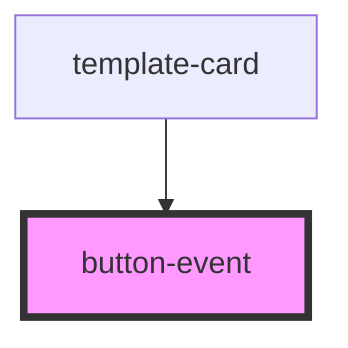

# button-event

<!-- Auto Generated Below -->

## Properties

| Property       | Attribute       | Description | Type     | Default     |
| -------------- | --------------- | ----------- | -------- | ----------- |
| `initialCount` | `initial-count` |             | `number` | `undefined` |

## Events

| Event            | Description | Type                  |
| ---------------- | ----------- | --------------------- |
| `countIncreased` |             | `CustomEvent<number>` |

## Dependencies

### Used by

 - [template-card](../template-card)

### Graph

----------------------------------------------

*Built with [StencilJS](https://stenciljs.com/)*
