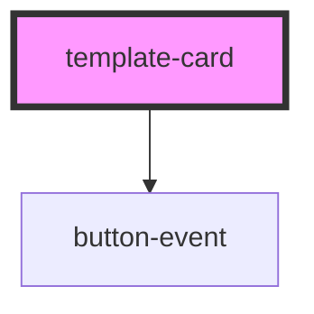

# template-card

<!-- Auto Generated Below -->

## Properties

| Property                  | Attribute                   | Description | Type      | Default     |
| ------------------------- | --------------------------- | ----------- | --------- | ----------- |
| `accomplishments`         | `accomplishments`           |             | `number`  | `0`         |
| `addComplementaryActions` | `add-complementary-actions` |             | `boolean` | `false`     |
| `age`                     | `age`                       |             | `number`  | `undefined` |
| `descriptionText`         | `description-text`          |             | `string`  | `undefined` |
| `first`                   | `first`                     |             | `string`  | `undefined` |
| `job`                     | `job`                       |             | `string`  | `undefined` |
| `last`                    | `last`                      |             | `string`  | `undefined` |

## Dependencies

### Depends on

- [button-event](../button-event)

### Graph

----------------------------------------------

*Built with [StencilJS](https://stenciljs.com/)*
